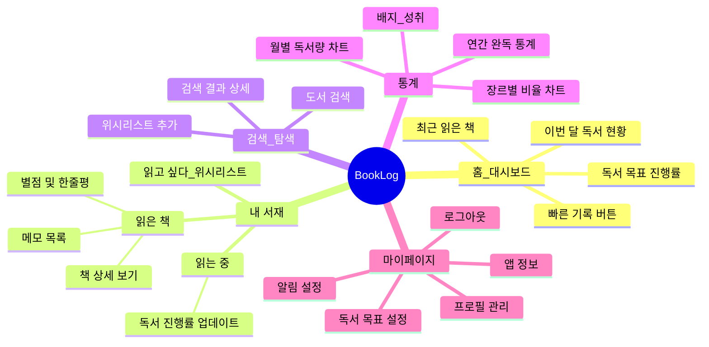
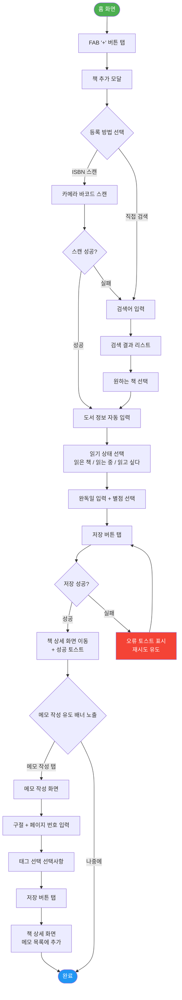

# .claude/rules/examples.md

# UX 설계자 — 산출물 예시 (Few-shot Examples)

> 이 파일은 UX 설계자 Agent가 **고품질 산출물을 생성하기 위한 실제 예시**를 제공한다.
> 예시는 `docs/example_prd.md`의 BookLog 앱을 기반으로 작성되었다.
> 새로운 PRD를 분석할 때 이 예시의 형식과 수준을 기준으로 삼는다.

---

## 예시 0: PRD 보완 요청

**상황**: PRD에 타겟 사용자 페르소나와 기능 우선순위가 누락된 경우

```markdown
## ⚠️ PRD 보완 요청

현재 제공된 PRD에 UX 설계를 시작하기 위한 필수 정보가 누락되어 있습니다.
아래 항목을 보완하여 PRD를 업데이트해 주시면 즉시 설계를 진행하겠습니다.

### 누락/불명확한 항목

| 항목 | 현재 상태 | 필요한 정보 |
|---|---|---|
| 타겟 사용자 페르소나 | 누락 | 주 타겟 사용자의 나이대, 직업, 주요 목표, Pain Point, 사용 환경 |
| 기능 우선순위 (MVP 범위) | 모든 기능이 동일 중요도로 표기됨 | MVP/Post-MVP 구분 및 출시 일정 |

### 추가 안내
- 페르소나 없이는 Happy Path 기준을 잡을 수 없어 사용자 중심 설계가 어렵습니다.
- 우선순위가 없으면 IA의 네비게이션 구조 및 화면 전환 순서를 결정하기 어렵습니다.
- 부분적으로라도 제공 가능한 정보가 있으면 먼저 공유해 주세요.
```

---

## 예시 1: 정보 구조도(IA) — BookLog 앱

---
서비스명: BookLog
산출물 유형: 정보 구조도(IA)
Version: v1.0 (PRD v1.0 기준)
작성일: 2026-04-13
작성자: UX 설계자 Agent (ux_designer v1.0)
상태: Draft
---

### 정보 구조도 (Information Architecture)



### IA 계층 구조

**BookLog**
├── 1. 홈/대시보드
│   ├── 이번 달 독서 현황 위젯
│   ├── 독서 목표 진행률 위젯
│   ├── 최근 읽은 책 리스트 (최대 3권)
│   └── [+] 빠른 책 기록 버튼 (FAB)
├── 2. 내 서재
│   ├── 2-1. 읽은 책 탭
│   │   ├── 책 상세 화면
│   │   │   ├── 메모 목록
│   │   │   └── 메모 작성/편집
│   │   └── 정렬/필터 (최신순, 별점순, 장르별)
│   ├── 2-2. 읽는 중 탭
│   │   └── 진행률 업데이트 모달
│   └── 2-3. 읽고 싶다 탭 (위시리스트)
├── 3. 검색/탐색
│   ├── 도서 검색창
│   ├── 검색 결과 리스트
│   └── 도서 상세 (외부 데이터)
│       ├── 내 서재에 추가 모달
│       └── 위시리스트 추가
├── 4. 통계
│   ├── 월별 독서량 바 차트
│   ├── 장르별 파이 차트
│   ├── 연간 완독 수 / 평균 완독 기간
│   └── 배지/성취 목록
└── ⚙ 마이페이지 (하단 탭)
    ├── 프로필 관리
    ├── 독서 목표 설정
    ├── 알림 설정
    ├── 앱 정보 / 고객센터
    └── 로그아웃

> **네비게이션 유형**: 하단 탭 바 (Bottom Tab Navigation) — 5개 탭
> **근거**: 모바일 표준 패턴, Fitts' Law — 엄지 접근 용이 영역 배치, 주요 목적지 빠른 이동
> **총 Depth**: 최대 4 Depth (홈 → 내 서재 → 책 상세 → 메모 작성)
> **총 주요 화면 수**: 약 12개

---

## 예시 2: 핵심 유저 플로우 — 책 등록 & 메모 작성

---
서비스명: BookLog
산출물 유형: 유저 플로우
Version: v1.0 (PRD v1.0 기준)
---

### 유저 플로우: 완독 책 등록 + 첫 메모 작성

> **대상 페르소나**: Kim Soyeon (28세, 독서 습관 형성 중인 직장인)
> **사용자 목표**: "읽은 책을 빠르게 기록하고, 인상적인 구절을 바로 메모하고 싶다"
> **Entry Point**: 홈 화면 (FAB 버튼 탭)
> **Goal**: 책 등록 완료 + 메모 1개 작성 완료



### 단계별 설명

| Step | 화면 | 사용자 액션 | 시스템 응답 | 데이터 | 비고 |
|---|---|---|---|---|---|
| 1 | 홈 화면 | FAB '+' 버튼 탭 | 책 추가 모달 Bottom Sheet 표시 | - | FAB는 엄지 접근 용이 우측 하단 고정 |
| 2 | 책 추가 모달 | 'ISBN 스캔' 또는 '직접 검색' 선택 | 선택에 따라 카메라 또는 검색창으로 이동 | - | 두 경로 모두 동일 결과로 수렴 |
| 3a | 바코드 스캔 | 책 바코드에 카메라 조준 | 자동 인식 → 도서 정보 로드 | ISBN, 도서 API 응답 | 실패 시 직접 검색으로 폴백 |
| 3b | 검색 화면 | 제목 또는 저자명 입력 | 0.3s 디바운스 후 검색 결과 표시 | 검색 키워드 | 결과 없음 시 Empty State + 안내 |
| 4 | 도서 선택 | 원하는 책 탭 | 도서 정보 자동 입력된 등록 폼 표시 | bookId, 제목, 저자, 표지 | - |
| 5 | 책 등록 폼 | 상태/완독일/별점 입력 후 저장 | 저장 처리 중 (로딩) → 성공 시 상세 화면 | readStatus, endDate, rating | 필수 입력: 읽기 상태만 |
| 6 | 책 상세 화면 | (자동) 메모 작성 유도 배너 확인 | 메모 작성 배너 + '메모 쓰기' CTA 표시 | - | 첫 방문 시에만 배너 노출 |
| 7 | 메모 작성 화면 | 구절/페이지/태그 입력 후 저장 | 메모 저장 → 책 상세의 메모 목록에 추가 | quote, pageNum, tags | 구절만 필수, 페이지·태그 선택 |

### 오류 흐름 (Error Flow)

| 오류 상황 | 트리거 | 사용자에게 표시 | 복구 경로 |
|---|---|---|---|
| ISBN 스캔 실패 | 조도 부족 또는 바코드 손상 | "스캔에 실패했습니다. 직접 검색해 주세요" 토스트 | 직접 검색 화면으로 자동 전환 |
| 도서 검색 결과 없음 | DB에 없는 책 | "검색 결과가 없습니다. 직접 입력하시겠어요?" | 수동 입력 폼 제공 |
| 저장 실패 (네트워크) | 오프라인 상태 | "연결을 확인해 주세요. 임시 저장됩니다." | 로컬 임시 저장 후 온라인 복구 시 자동 동기화 |

### Alternative Path

| 대안 경로명 | 설명 | 진입 시점 |
|---|---|---|
| 검색 탭에서 등록 | 검색 결과에서 바로 내 서재 추가 | Step 3b 검색 화면 |
| 위시리스트 이동 | '읽고 싶다' 상태로 저장 | Step 5 등록 폼 |

---

## 예시 3: 화면 별 UI 컴포넌트 정의 — 홈 화면

---
서비스명: BookLog
산출물 유형: 화면 컴포넌트 정의
Version: v1.0 (PRD v1.0 기준)
---

### 화면: 홈/대시보드

> **화면 목적**: 사용자의 독서 현황을 한눈에 파악하고 빠른 액션(책 추가)을 유도하는 메인 진입점
> **진입 경로**: 앱 실행 또는 하단 탭 '홈' 탭
> **이탈 경로**: FAB → 책 추가 모달 / 위젯 탭 → 해당 상세 화면 / 하단 탭 → 각 탭
> **플랫폼**: Mobile (iOS / Android 공통)

### UI 컴포넌트 정의

| 컴포넌트명 | 영역 | 목적 | 상태 | 필수 인터랙션 | 접근성 고려사항 |
|---|---|---|---|---|---|
| 앱 로고/제목 | Header | 서비스 아이덴티티 표시 | - | - | alt text "BookLog 홈" |
| 알림 아이콘 버튼 | Header | 알림 화면으로 이동 | Enabled / Unread Badge | 탭 → 알림 화면 | ARIA label="알림, 새 알림 N개", 44×44px |
| 독서 목표 진행 위젯 | Content | 연간 목표 달성률 시각화 | 목표 설정됨 / 미설정 | 탭 → 목표 설정 화면 또는 통계 화면 | 색 외 텍스트로도 진행률 표시 ("12권 중 5권") |
| 이번 달 독서 현황 카드 | Content | 이번 달 완독 권수 + 독서 시간 | Populated / Empty | 탭 → 통계 화면 | 숫자와 단위 함께 읽기 ("이번 달 2권 완독") |
| 최근 읽은 책 리스트 | Content | 최근 3권 빠른 접근 | Populated / Empty State | 책 탭 → 책 상세 화면 / "더보기" → 내 서재 | 책 표지 alt text = 책 제목 |
| Empty State (책 없음) | Content | 첫 사용자 온보딩 유도 | Empty | "첫 책 기록하기" CTA 탭 → 책 추가 모달 | role="region", 안내 텍스트 명확히 |
| FAB (책 추가) 버튼 | CTA | 책 추가 진입점 (가장 핵심 CTA) | Enabled | 탭 → 책 추가 Bottom Sheet | ARIA label="책 추가", 56×56px, 우측 하단 고정 |
| 하단 탭 바 | Navigation | 5개 주요 탭 이동 | 홈 탭 Active | 탭 → 해당 탭 화면 | 각 탭 ARIA label 명시, Active 상태 색+텍스트로 표시 |

### 레이아웃 가이드

- **화면 구조**: [Header 56px] + [스크롤 컨텐츠 영역] + [하단 탭 바 56px] + [FAB 우측 하단 오버레이]
- **여백**: 좌우 패딩 16px, 위젯 간 간격 12px, 섹션 타이틀과 컨텐츠 간 8px
- **스크롤**: 세로 스크롤 (Header는 스크롤 시 숨김, FAB는 항상 고정)
- **FAB 위치**: 하단 탭 바 위 16px + 우측 16px (엄지 접근 최적 영역)

### Empty State 가이드

- **조건**: 등록된 책이 0권인 첫 사용자
- **표시 내용**: 일러스트 + "아직 기록한 책이 없어요" + "첫 책을 기록해보세요" CTA 버튼
- **CTA**: 책 추가 모달로 연결 (FAB와 동일한 액션)

---

## 예시 4: Self-Review 결과

```markdown
## UX 원칙 Self-Review — BookLog v1.0

### 4대 설계 원칙 검증

| 원칙 | 평가 | 근거 |
|---|---|---|
| 직관성 | ✅ 충족 | 하단 탭 바는 모바일 표준 패턴, 레이블+아이콘 병용, FAB로 핵심 액션 강조 |
| 효율성 | ✅ 충족 | 책 등록 최소 3 Steps (FAB→스캔→저장), 홈에서 최근 책 바로 접근 가능 |
| 접근성 | ⚠️ 부분 충족 | ARIA label 정의됨, 색 대비 가이드 포함. 단, 실제 색상 값은 UI 디자이너와 협의 필요 |
| 일관성 | ✅ 충족 | 전 화면 동일 하단 탭 바, 동일 FAB 위치, 동일 토스트 패턴 사용 |

### Nielsen 10 Heuristics 요약

| # | 원칙 | 적용 여부 | 비고 |
|---|---|---|---|
| 1 | 시스템 상태 가시성 | ✅ | 로딩 스피너, 저장 중 버튼 비활성화, 성공 토스트 |
| 2 | 실제 세계와의 매칭 | ✅ | '내 서재', '읽는 중' 등 실제 독서 행동 용어 사용 |
| 3 | 사용자 제어 및 자유 | ✅ | 모든 모달에 닫기, 뒤로가기 제공 |
| 4 | 일관성 및 표준 | ✅ | iOS/Android 플랫폼 네이티브 컴포넌트 준수 |
| 5 | 오류 예방 | ✅ | ISBN 스캔 실패 시 자동 폴백, 저장 전 필수 입력 검증 |
| 6 | 인식 vs 기억 | ✅ | 최근 읽은 책 홈 노출, 검색 자동완성, 이전 입력 유지 |
| 7 | 유연성 및 효율성 | ⚠️ | 단축 등록(스캔) 있음. 파워 유저용 일괄 등록 기능은 Post-MVP |
| 8 | 미적 & 미니멀 디자인 | ✅ | 화면 당 CTA 1개 원칙, 불필요한 정보 최소화 |
| 9 | 오류 인식 & 복구 | ✅ | 구체적 오류 메시지 + 복구 방법 제시 (재시도, 폴백 경로) |
| 10 | 도움말 및 문서 | ⚠️ | 첫 사용자 Empty State 가이드 있음. 온보딩 튜토리얼은 Post-MVP 검토 |

### 개선 제안

1. **온보딩 튜토리얼**: 최초 로그인 사용자 대상 4단계 스와이프 온보딩 (Post-MVP 권고)
2. **독서 리마인더 알림**: 목표 달성을 위한 주간 독서 알림 → 재방문율 개선 기대 (Post-MVP)
3. **책 메모 검색**: 메모가 많아질수록 검색 기능 필요성 증가 → v1.1 추가 권고
```

---

*이 예시들은 BookLog 앱 PRD 기반으로 작성된 실제 수준의 UX 설계 산출물이다.*
*새로운 PRD 분석 시 이 예시의 상세도와 형식을 기준으로 삼는다.*
