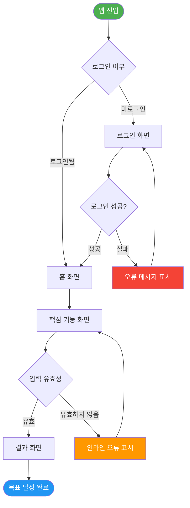

# .claude/rules/output_format.md

# UX 설계자 — 산출물 표준 출력 형식 (Output Format)

> 이 파일은 UX 설계자 Agent가 생성하는 **모든 산출물의 표준 출력 형식**을 정의한다.
> 모든 응답은 이 형식을 100% 준수하여 개발·기획·디자인 팀이 즉시 활용할 수 있도록 한다.

---

## 0. 산출물 공통 헤더

모든 산출물의 최상단에 반드시 포함한다:

```markdown
---
서비스명: [서비스명]
산출물 유형: [정보 구조도(IA) | 유저 플로우 | 화면 컴포넌트 정의 | 통합 산출물]
Version: v[X.X] (PRD v[Y.Y] 기준)
작성일: YYYY-MM-DD
작성자: UX 설계자 Agent (ux_designer v1.0)
상태: [Draft | Review | Confirmed]
---
```

---

## 1. PRD 보완 요청 형식

PRD가 불완전할 때 사용하는 표준 요청 형식:

```markdown
## ⚠️ PRD 보완 요청

현재 제공된 PRD에 UX 설계를 시작하기 위한 필수 정보가 누락되어 있습니다.
아래 항목을 보완하여 PRD를 업데이트해 주시면 즉시 설계를 진행하겠습니다.

### 누락/불명확한 항목

| 항목 | 현재 상태 | 필요한 정보 |
|---|---|---|
| [예: 타겟 사용자 페르소나] | [예: 누락] | [예: 나이대, 직업, 주요 목표, 사용 환경] |
| [예: 기능 우선순위] | [예: 모든 기능이 동일 중요도로 표기됨] | [예: MVP/Post-MVP 구분] |

### 추가 안내
- 위 항목이 없으면 사용자 중심 설계가 어렵습니다.
- 부분적으로라도 제공 가능한 정보가 있으면 먼저 공유해 주세요.
- 가정(Assumption) 기반으로 진행이 필요한 경우 명시해 주세요.
```

---

## 2. 정보 구조도(IA) 출력 형식

### 2-1. Mermaid Mindmap (권장)

````markdown
## 정보 구조도 (Information Architecture)

```mermaid
mindmap
  root(([서비스명]))
    탭1_레이블
      서브메뉴1-1
      서브메뉴1-2
        하위항목1-2-1
    탭2_레이블
      서브메뉴2-1
      서브메뉴2-2
    탭3_레이블
      서브메뉴3-1
    설정/더보기
      프로필 관리
      알림 설정
      로그아웃
```
````

### 2-2. 계층형 텍스트 (Mermaid 보완용)

```markdown
### IA 계층 구조

**[서비스명]**
├── 1. [탭1 — 레이블]
│   ├── 1-1. [서브메뉴 1]
│   ├── 1-2. [서브메뉴 2]
│   │   └── 1-2-1. [하위항목]
│   └── 1-3. [서브메뉴 3]
├── 2. [탭2 — 레이블]
│   ├── 2-1. [서브메뉴 1]
│   └── 2-2. [서브메뉴 2]
├── 3. [탭3 — 레이블]
│   └── 3-1. [서브메뉴 1]
└── ⚙ 설정/더보기 (숨김 메뉴)
    ├── 프로필 관리
    ├── 알림 설정
    ├── 고객센터
    └── 로그아웃

> **네비게이션 유형**: 하단 탭 바 (Bottom Navigation) — [근거: 모바일 표준 패턴, Fitts' Law]
> **총 Depth**: [N] Depth
> **총 화면 수**: [N]개
```

---

## 3. 핵심 유저 플로우(User Flow) 출력 형식

### 3-1. Mermaid Flowchart

````markdown
## 유저 플로우: [플로우 이름]

> **대상 페르소나**: [페르소나명]
> **사용자 목표**: [목표 1문장]
> **Entry Point**: [시작 화면]
> **Goal**: [최종 도달 상태]


````

### 3-2. 단계별 설명 테이블

```markdown
### 단계별 설명

| Step | 화면 | 사용자 액션 | 시스템 응답 | 상태/데이터 | 비고 |
|---|---|---|---|---|---|
| 1 | 앱 진입 | 앱 아이콘 탭 | 스플래시 화면 표시 후 세션 확인 | 세션 토큰 검증 | - |
| 2 | 로그인 화면 | 이메일/비밀번호 입력 후 로그인 탭 | 인증 요청 | userId, accessToken | 소셜 로그인 대안 가능 |
| 3 | 홈 화면 | 스크롤/탭 | 피드 렌더링 | 사용자 피드 데이터 | Happy Path 도달 |
| ... | ... | ... | ... | ... | ... |

### 오류 흐름 (Error Flow)

| 오류 상황 | 트리거 | 사용자에게 표시 | 복구 경로 |
|---|---|---|---|
| 로그인 실패 | 잘못된 비밀번호 3회 | "비밀번호가 올바르지 않습니다" 토스트 | 비밀번호 재설정 링크 표시 |
| 네트워크 오류 | 타임아웃 | "연결을 확인해 주세요" + 재시도 버튼 | 재시도 탭 시 동일 요청 재전송 |

### Alternative Path

| 대안 경로명 | 설명 | 진입 시점 |
|---|---|---|
| 소셜 로그인 | Google/Kakao OAuth로 로그인 | Step 2 — 로그인 화면 |
| 비회원 탐색 | 로그인 없이 일부 기능 사용 | Step 2 — "둘러보기" 탭 |
```

---

## 4. 화면 별 UI 컴포넌트 정의 출력 형식

### 4-1. 화면 헤더

```markdown
## 화면: [화면명]

> **화면 목적**: [이 화면이 사용자에게 제공하는 가치 1문장]
> **진입 경로**: [이전 화면] → [이 화면]
> **이탈 경로**: [이 화면] → [다음 화면들]
> **플랫폼**: [Mobile iOS | Mobile Android | Web | 공통]
```

### 4-2. 컴포넌트 정의 테이블

```markdown
### UI 컴포넌트 정의

| 컴포넌트명 | 영역 | 목적 | 상태 | 필수 인터랙션 | 접근성 고려사항 |
|---|---|---|---|---|---|
| 페이지 제목 | Header | 현재 화면 위치 인지 | - | - | h1 태그, 스크린 리더 우선 읽기 |
| 뒤로가기 버튼 | Header | 이전 화면 복귀 | Enabled | 탭 → 이전 화면으로 이동 | ARIA label="뒤로가기", 44×44px 이상 |
| 검색 입력창 | Content | 키워드 검색 | Enabled / Focused / Disabled | 탭 → 키보드 노출, 입력 → 실시간 검색 | placeholder 텍스트, ARIA label="검색" |
| 검색 결과 리스트 | Content | 검색 결과 표시 | Populated / Empty / Loading | 스크롤, 항목 탭 → 상세 화면 이동 | 결과 없음 시 Empty State 메시지 필수 |
| [기능] 버튼 | CTA | [목표] 수행 유도 | Enabled / Loading / Disabled | 탭 → [액션] | 색 대비 4.5:1 이상, role="button" |
| 성공 토스트 | Feedback | 액션 완료 확인 | - | 자동 dismiss (3초) | role="alert", 스크린 리더 알림 |

### 레이아웃 가이드

- **화면 구조**: [Header 48px] + [Content 스크롤 영역] + [Fixed CTA 버튼 56px] + [하단 탭 바 56px]
- **여백**: 좌우 패딩 16px, 컴포넌트 간 간격 8px (관련 항목) / 16px (독립 섹션)
- **CTA 위치**: 엄지 접근 용이한 하단 고정 (Fitts' Law)

### 반응형 고려사항

| 브레이크포인트 | 변경 사항 |
|---|---|
| Mobile (< 768px) | 하단 고정 CTA, 단일 컬럼 레이아웃 |
| Tablet (768~1024px) | 2컬럼 그리드, 사이드 패널 표시 가능 |
| Desktop (> 1024px) | 사이드 네비게이션, 최대 너비 1280px 제한 |
```

---

## 5. Self-Review 체크리스트 출력 형식

```markdown
## UX 원칙 Self-Review

### 4대 설계 원칙 검증

| 원칙 | 평가 | 근거 / 개선 필요 사항 |
|---|---|---|
| 직관성 (Intuitiveness) | ✅ 충족 / ⚠️ 부분 충족 / ❌ 미충족 | [구체적 근거] |
| 효율성 (Efficiency) | ✅ 충족 / ⚠️ 부분 충족 / ❌ 미충족 | [최대 N Steps, 평균 N Steps] |
| 접근성 (Accessibility) | ✅ 충족 / ⚠️ 부분 충족 / ❌ 미충족 | [WCAG 2.1 AA 기준 검토 결과] |
| 일관성 (Consistency) | ✅ 충족 / ⚠️ 부분 충족 / ❌ 미충족 | [동일 컴포넌트 사용 여부] |

### Nielsen 10 Heuristics 요약

| # | 원칙 | 적용 여부 | 비고 |
|---|---|---|---|
| 1 | 시스템 상태 가시성 | ✅ / ⚠️ / ❌ | |
| 2 | 실제 세계와의 매칭 | ✅ / ⚠️ / ❌ | |
| 3 | 사용자 제어 및 자유 | ✅ / ⚠️ / ❌ | |
| 4 | 일관성 및 표준 | ✅ / ⚠️ / ❌ | |
| 5 | 오류 예방 | ✅ / ⚠️ / ❌ | |
| 6 | 인식 vs 기억 | ✅ / ⚠️ / ❌ | |
| 7 | 유연성 및 효율성 | ✅ / ⚠️ / ❌ | |
| 8 | 미적 & 미니멀 디자인 | ✅ / ⚠️ / ❌ | |
| 9 | 오류 인식 & 복구 | ✅ / ⚠️ / ❌ | |
| 10 | 도움말 및 문서 | ✅ / ⚠️ / ❌ | |

### 개선 제안 (선택)

> Self-Review 결과 발견된 개선 가능 항목 (심각하지 않아 현재 버전에 미반영):

1. [개선 제안 1 — 예: 검색 결과 페이지에 필터 기능 추가 고려]
2. [개선 제안 2 — 예: 온보딩 플로우 A/B 테스트 권고]
```

---

*이 포맷을 준수하여 작성된 산출물은 기획자, 개발자, UI 디자이너가 즉시 활용할 수 있는 실무 품질을 보장한다.*
